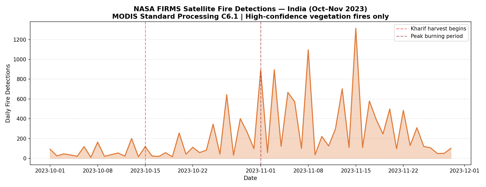
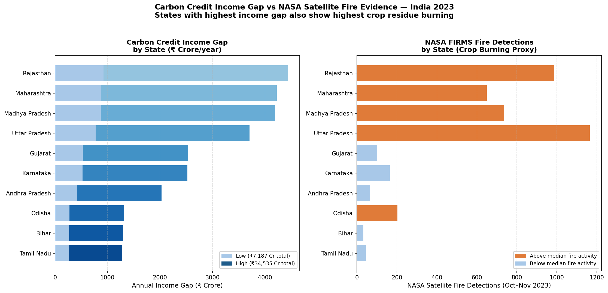
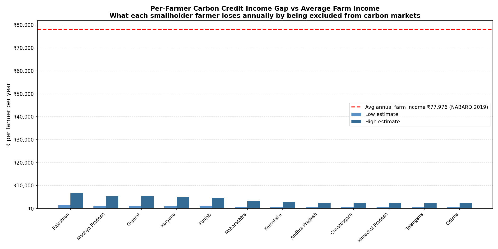
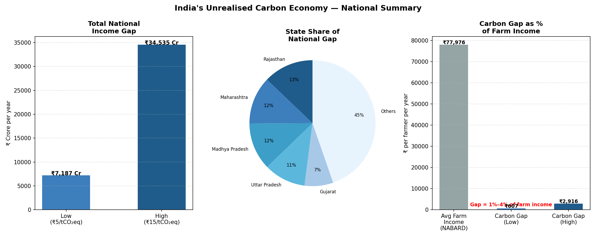

# The Unrealised Carbon Economy - India
## Quantifying Lost Carbon Credit Income for Smallholder Farmers Using NASA Satellite Data

**Author:** Vanshita Sharma  
**Credentials:** M.Sc. Agronomy (SHUATS) | ISO 14064 GHG Lead Verifier (TÜV SÜD)  
**Published:** May 2026  
**Status:** Working Paper / Policy Brief  

---

## Headline Finding

> India's 128.9 million smallholder farmers are losing between **₹7,187 crore and ₹34,535 crore every year** in unrealised carbon credit income - simply because they cannot access India's carbon market. This equals 1%–4% of average annual farm income per farmer, every single year.

---

## The Problem

India launched its Carbon Credit Trading Scheme (CCTS) in 2023. Yet agriculture - which accounts for nearly 20% of India's total GHG emissions - remains effectively inaccessible to the 128.9 million smallholder farmers who could earn income by adopting low-carbon practices.

Every existing study frames this as a *future opportunity*. This study turns that around and asks: **what is the cost of exclusion right now?**

---

## Research Gap

Yadav et al. (2024) assessed carbon credit potential for conservation agriculture in Bihar and Punjab for the wheat season using primary farmer surveys - finding potential income of $18/ha in Bihar and $30/ha in Punjab. However, no study has:

- Quantified the income gap at **national scale across all major agricultural states**
- Used **NASA satellite fire data (MODIS C6.1)** as an independent evidence layer for crop residue burning
- Framed the finding as an **exclusion cost** rather than a future opportunity
- Connected the gap specifically to India's **Carbon Credit Trading Scheme (CCTS) framework** launched in 2023

This study addresses all four gaps using publicly available institutional data sources.

---

## Data Sources

| Dataset | Source | Citation |
|---|---|---|
| Active fire detections | NASA FIRMS MODIS_SP C6.1 | NASA LANCE FIRMS (2023) |
| Agricultural GHG emissions | FAOSTAT | FAO (2024) |
| State-wise farm holdings | Agriculture Census 2015-16 | Govt. of India, DAC&FW |
| Carbon reduction factors | Peer-reviewed literature | Yadav et al. (2024), NIH/PubMed |
| VCM price range | World Bank Carbon Pricing | World Bank (2024) |
| Average farm income | NABARD NAFIS Survey | NABARD (2019) |

---

## Methodology

**Step 1 - NASA Satellite Fire Evidence**  
Downloaded 18,963 high-confidence vegetation fire detections for India (Oct–Nov 2023) directly from NASA FIRMS API (MODIS Standard Processing, Collection 6.1). Filtered to type=0 (presumed vegetation fire) and confidence ≥ 50. Mapped detections to states using Survey of India bounding coordinates.

**Step 2 - Carbon Credit Potential**  
Applied peer-reviewed carbon reduction factors (1.23–1.97 tCO₂eq/ha/year, Yadav et al. 2024) to state-wise smallholder farm area from Agriculture Census 2015-16 (86.21% smallholder share, avg holding 1.08 ha).

**Step 3 - Income Gap Calculation**  
Converted carbon credit potential to INR income using Voluntary Carbon Market price range ($5–$15/tCO₂eq, World Bank 2024) at RBI reference rate (₹83.5/USD). Expressed as total state-level gap (₹ crore/year) and per-farmer annual loss.

**Step 4 - Policy Context**  
Benchmarked per-farmer carbon gap against average annual farm income (₹77,976, NABARD NAFIS 2019) to contextualise the exclusion cost at household level.

---

## Key Findings

### 1. National Income Gap
| Scenario | VCM Price | Annual Income Gap |
|---|---|---|
| Conservative | $5/tCO₂eq | ₹7,187 crore/year |
| Optimistic | $15/tCO₂eq | ₹34,535 crore/year |

### 2. Farmers Affected
**128.9 million** smallholder farmers across 20 major states

### 3. Per Farmer Annual Loss
| Scenario | Loss per Farmer | % of Farm Income |
|---|---|---|
| Conservative | ₹607/year | 1% |
| Optimistic | ₹2,916/year | 4% |

### 4. NASA Fire Evidence — Top Burning States
| State | Fire Detections (Oct–Nov 2023) |
|---|---|
| Punjab | 7,672 |
| Uttar Pradesh | 1,165 |
| Rajasthan | 986 |
| Madhya Pradesh | 735 |
| Maharashtra | 650 |

### 5. Carbon Reduction Potential
**275.7 million tCO₂eq/year** - if all smallholder farmers adopt conservation agriculture practices. This represents a significant contribution to India's Updated NDC (2022) AFOLU sector targets.

---

## Visualisations

### NASA Satellite Fire Timeline - India Oct–Nov 2023

### Carbon Credit Income Gap vs NASA Fire Evidence by State

### Per Farmer Income Gap vs Average Farm Income

### National Summary

---

## Policy Implications

1. **Extend CCTS to agriculture immediately** - the income exclusion cost is ₹7,187–34,535 crore annually, not a future risk but a present reality
2. **Prioritise Punjab and Haryana** - NASA satellite data confirms these states have the highest burning intensity and therefore the highest abatement potential
3. **Design aggregation mechanisms** - smallholder farm sizes (avg 1.08 ha) are too small for individual carbon credit issuance; state-level or cooperative aggregation models are essential
4. **Use satellite monitoring for MRV** - NASA FIRMS data demonstrates that Monitoring, Reporting and Verification (MRV) of agricultural burning is already technically feasible at zero additional cost

---

## Repository Structure

- `download_nasa_fire.py` — NASA FIRMS API download script
- `carbon_gap_analysis.py` — Main analysis (all 5 steps)
- `india_fire_2023.csv` — Raw NASA FIRMS data (18,963 detections)
- `carbon_credit_gap_results.csv` — State-level results table
- `chart_nasa_fire_timeline.png` — NASA fire detections timeline
- `chart_gap_vs_fires.png` — Income gap vs fire evidence
- `chart_per_farmer_gap.png` — Per farmer loss analysis
- `chart_national_summary.png` — National summary dashboard

---

## Citation

If you use this analysis, please cite:

> Sharma, V. (2026). *The Unrealised Carbon Economy: Quantifying Lost Carbon Credit Income for India's Smallholder Farmers Using NASA Satellite Data.* Working Paper. GitHub: https://github.com/vanshitasharma-555/india-carbon-credit-gap

---

## Acknowledgements

Fire data: NASA FIRMS (https://firms.modaps.eosdis.nasa.gov)  
Emissions data: FAO FAOSTAT (https://faostat.fao.org)  
Agriculture data: Government of India, Department of Agriculture & Farmers Welfare  
Income data: NABARD All India Rural Financial Inclusion Survey 2019
